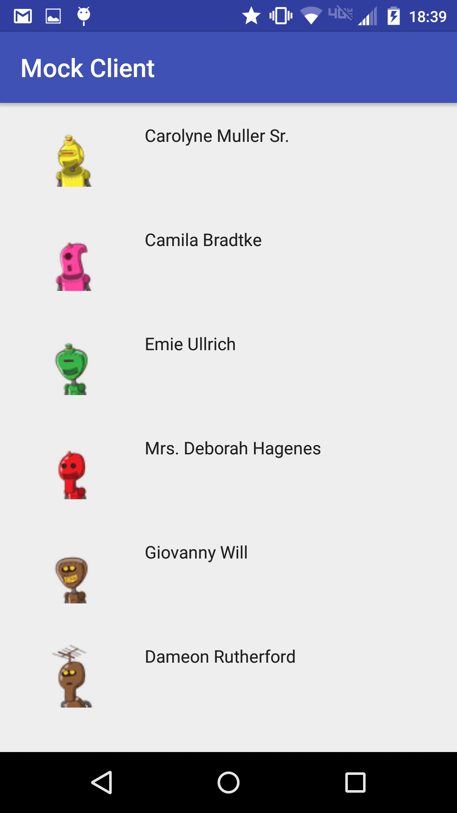
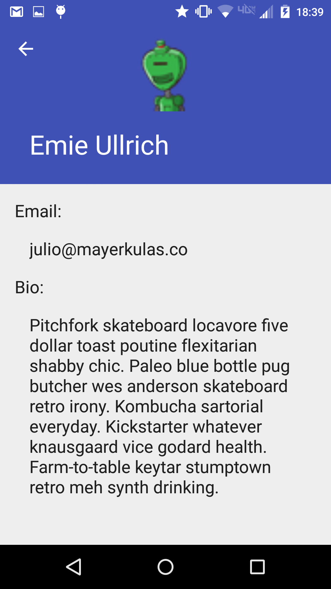

# Server

Tested Rack app that uses Faker gem to generate fake data.  Hit [the api](http://arcane-savannah-2535.herokuapp.com) to see what it does.

# Client

Android app that hits the server above and gives a frontend.  Uses Volley for async http requests.  NOTE: I accidentally named it MockServer instead of MockClient, and hilariously Android Studio has no *simple* way to fix this seemingly simple error.

